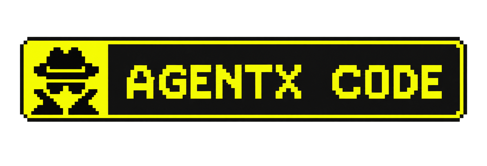
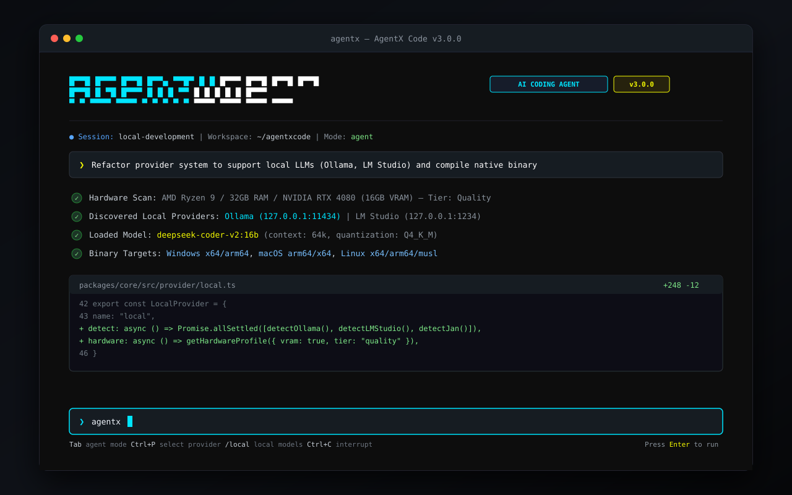

<p align="center">
  <a href="https://agentx.js.org">
    <picture>
      <source srcset="agentx_code.png" media="(prefers-color-scheme: dark)">
      <source srcset="agentx_code.png" media="(prefers-color-scheme: light)">
      
    </picture>
  </a>
</p>

<h1 align="center">AgentX Code</h1>
<p align="center"><strong>The autonomous AI coding agent built for the terminal.</strong></p>

<p align="center">
  <a href="https://www.npmjs.com/package/@agent-qofeno/agentx-cli"></a>
  <a href="https://jsr.io/@agent-qofeno/agentx-cli"></a>
  <a href="https://github.com/SohailKhan0525/agentxcode/blob/dev/LICENSE"></a>
  <a href="https://github.com/SohailKhan0525/agentxcode/actions/workflows/test.yml"></a>
  <a href="https://github.com/SohailKhan0525/agentxcode"></a>
</p>

```
   /\   /----\  |----\ |\   | ----- \    /     _��� _��� ���_ ����
  /  \  |    -- |    | | \  |   |    \  /      �    �  � �  � ����
 /----\ |  ---| |----/ |  \ |   |     \/       �___ �__� �__� ����
/      \\-----/ |----/ |   \|   |    /  \
```

<p align="center">
  <a href="README.md">English</a> |
  <a href="README.zh.md">????</a> |
  <a href="README.zht.md">????</a> |
  <a href="README.ko.md">???</a> |
  <a href="README.de.md">Deutsch</a> |
  <a href="README.es.md">Espa�ol</a> |
  <a href="README.fr.md">Fran�ais</a> |
  <a href="README.it.md">Italiano</a> |
  <a href="README.da.md">Dansk</a> |
  <a href="README.ja.md">???</a> |
  <a href="README.pl.md">Polski</a> |
  <a href="README.ru.md">???????</a> |
  <a href="README.bs.md">Bosanski</a> |
  <a href="README.ar.md">???????</a> |
  <a href="README.no.md">Norsk</a> |
  <a href="README.br.md">Portugu�s (Brasil)</a> |
  <a href="README.th.md">???</a> |
  <a href="README.tr.md">T�rk�e</a> |
  <a href="README.uk.md">??????????</a> |
  <a href="README.bn.md">?????</a> |
  <a href="README.gr.md">????????</a> |
  <a href="README.vi.md">Ti?ng Vi?t</a>
</p>

<p align="center">
  
</p>

---

## Quick Start

### Installation

Install **AgentX Code** via your preferred toolchain:

#### via npm (Recommended)

```bash
npm install -g @agent-qofeno/agentx-cli@latest
```

_(Also works with `bun add -g @agent-qofeno/agentx-cli`, `pnpm add -g @agent-qofeno/agentx-cli`, or `yarn global add @agent-qofeno/agentx-cli`)_

#### via curl (Linux & macOS)

```bash
curl -fsSL https://agentx.js.org/install | bash
```

#### via PowerShell (Windows)

```powershell
irm https://agentx.js.org/install.ps1 | iex
```

#### via Homebrew

```bash
brew install SohailKhan0525/agentx/agentx
```

#### via JSR

```bash
bunx jsr add @agent-qofeno/agentx-cli
```

### Launch

Run the agent anywhere inside your workspace:

```bash
agentx
```

Or run directly with an initial instruction:

```bash
agentx run "Inspect the project structure and summarize the database schema"
```

---

## Key Features

### ??? Local Models First (Zero API Keys Required)

Run completely offline with private, sovereign AI. AgentX Code scans your machine, interrogates running runtimes (Ollama, LM Studio, Jan, LocalAI, llama.cpp, GPT4All), detects your CPU, RAM, GPU, and VRAM, and recommends optimal quantized models.

```bash
agentx local --scan
agentx local --pull qwen2.5-coder:7b
```

### ?? Universal Multi-Model Orchestration

Switch seamlessly between local engines and premier cloud providers:

- **Local:** Ollama, LM Studio, Jan, llama.cpp, LocalAI
- **Cloud:** Anthropic (Claude 3.7 Sonnet / Opus), OpenAI (GPT-4o, o1, o3-mini), Google (Gemini 2.5 Pro / Flash), Groq, DeepSeek, Mistral, xAI (Grok), Cerebras, Cohere, Perplexity, OpenRouter, AWS Bedrock, Azure OpenAI

### ?? Cyan High-Contrast Terminal UI

Engineered for intense developer focus with high-performance Solid.js terminal rendering:

- Cyan highlight color tokens (`#00E5FF` / ANSI `\x1b[96m`)
- Visual multi-file diff inspection and approval
- Split-footer non-intrusive interactive prompt
- Smooth keyboard navigation (`Tab` switches agents, `Ctrl+C` cancels, `Esc` dismisses)

### ??? Extensible Tool Architecture

- **Terminal Execution:** Live streaming bash & command executions
- **File System:** High-speed fuzzy search, AST ripgrep, surgical surgical file patchers
- **Web Research:** Search and crawl web documentation on demand
- **Model Context Protocol (MCP):** Connect external tools, databases, and sidecars via stdio or SSE

### ?? Subagent System

- **build:** Primary full-access development agent
- **plan:** Read-only architectural planning and exploration
- **general:** Autonomous worker delegation for parallel search and research

---

## Local Models Guide

AgentX Code includes an automated hardware profiler that evaluates your machine and matches it to a curated catalog of open-weights models:

| Hardware Tier | Recommended Specs                 | Recommended Models                                              | Performance Profile                                                |
| :------------ | :-------------------------------- | :-------------------------------------------------------------- | :----------------------------------------------------------------- |
| **Fast**      | CPU only or <8 GB RAM / 2 GB VRAM | `qwen2.5-coder:1.5b`<br>`llama3.2:3b`<br>`deepseek-coder:1.3b`  | Instant auto-completion, lightweight scripts, zero GPU dependency  |
| **Balanced**  | 8�16 GB RAM / 4�8 GB VRAM         | `qwen2.5-coder:7b`<br>`deepseek-coder-v2:16b`<br>`codellama:7b` | Full refactors, bug fixing, test writing, architectural reasoning  |
| **Quality**   | 16+ GB RAM / 8+ GB VRAM           | `qwen2.5-coder:14b`<br>`qwen2.5-coder:32b`<br>`codestral:22b`   | Complex system designs, multi-file codebases, frontier performance |

### Local CLI Commands

```bash
# Scan system hardware and active local providers
agentx local --scan

# Pull an Ollama model with live progress streaming
agentx local --pull qwen2.5-coder:7b

# Launch interactive local provider setup
agentx local
```

---

## Configuration

AgentX Code configuration files are located in `.agentx` within your project or home directory:

- **Project Configuration:** `<workspace>/.agentx/agentx.json`
- **Global Configuration:** `~/.agentx/agentx.json`

_(Full backwards compatibility: Existing `.opencode` directories and `opencode.json` configuration files are automatically recognized as fallbacks)._

Example `agentx.json`:

```json
{
  "$schema": "https://agentx.js.org/schema.json",
  "theme": "cyan",
  "provider": {
    "local": {
      "endpoint": "http://127.0.0.1:11434"
    }
  },
  "agent": {
    "build": {
      "model": "local/qwen2.5-coder:7b"
    }
  }
}
```

---

## Migrating from AgentX Code

AgentX Code is a standalone fork and evolution of AgentX Code:

- Command name: `agentx` (legacy alias `opencode` is preserved)
- Package: `@agent-qofeno/agentx-cli`
- Config folder: `.agentx/` (with fallback to `.opencode/`)
- Pure terminal focus with zero proprietary cloud lock-ins

---

## License & Attribution

AgentX Code is licensed under the [MIT License](LICENSE).

Based upon the foundational work by the AgentX Code authors and contributors.

AgentX Code is maintained and developed by [Sohail Khan](https://github.com/SohailKhan0525).
